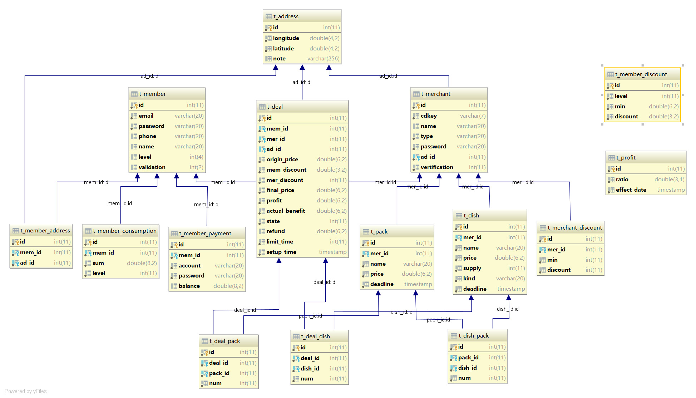
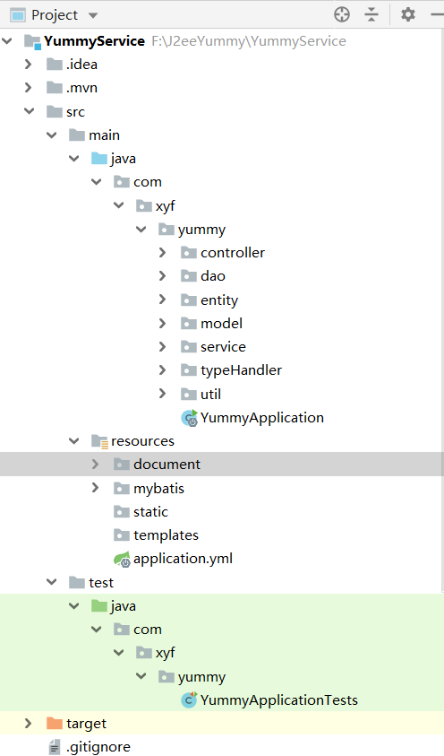
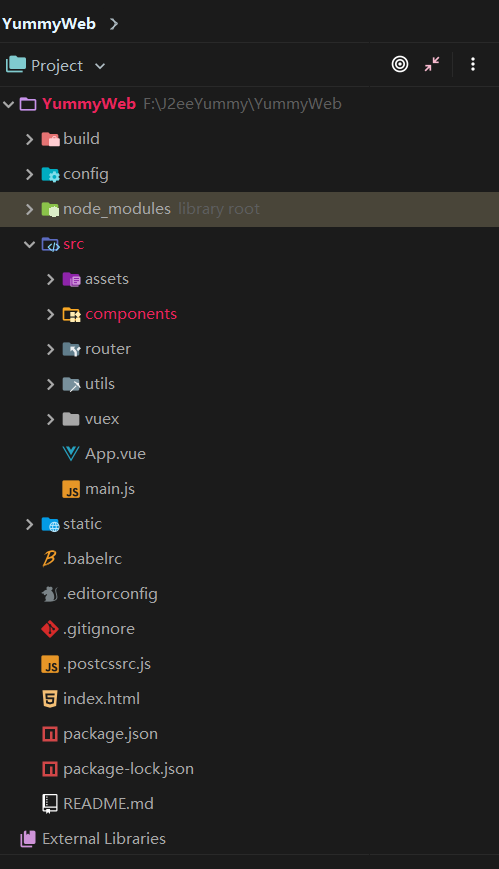

项目选择： Yummy
----------------

\-项目设计-
===========

### \-数据库设计-

ER-关系图

>   pk--primary key, fk--foreign key, ++--auto increment,
>   enum--java中数据类型对应一个枚举类

#### 会员

-   t_member

-   id int pk ++

-   email varchar(20)

-   password varchar(20)

-   phone varchar(20)

-   name varchar(20)

-   level int // enum

-   validation int // enum

#### 会员支付账号

-   t_member_payment

-   id int pk ++

-   mem_id `fk => t_member(id)`

-   account varchar(20)

-   password varchar(20)

-   balance double(8,2)

#### 会员消费

-   t_member_consumption

-   id int pk ++

-   mem_id `fk => t_member(id)`

-   sum double(6,2)

-   level int

#### 地址

-   t_address

-   id int pk ++

-   longitude double(4,2)

-   latitude double(4,2)

-   note varchar(256)

#### 会员地址(中间表)

-   t_member_address

-   id int pk ++

-   mem_id `fk => t_member(id)`

-   ad_id `fk => t_address(id)`

#### 会员等级优惠政策（打折）

-   t_member_discount

-   id int pk ++

-   level int // enum

-   discount double(3,2) // 0.01-0.99

#### 餐厅

-   t_merchant

-   id int pk ++

-   cdkey varchar(7)

-   name varchar(20)

-   type varchar(20) // enum 'other' 其他

-   password varchar(20)

-   ad_id `fk => t_address(id)`

-   vertification int // enum

#### 餐厅优惠政策（满减）

-   t_merchant_discount

-   id int pk ++

-   mer_id `fk => t_merchant(id)`

-   min int // 满

-   discount int // 减

#### 菜单菜品

-   t_dish

-   id int pk ++

-   mer_id `fk => t_merchant(id)`

-   name varchar(20)

-   price double(6,2)

-   supply int

-   kind varchar(20) // enum

-   deadline timestamp

#### 菜单套餐

-   t_pack

-   id int pk ++

-   mer_id `fk => t_merchant(id)`

-   name varchar(20)

-   price double(6,2)

-   deadline timestamp

#### 菜单菜品套餐中间表

-   t_dish_pack

-   id int pk ++

-   pack_id `fk => t_dish(id)`

-   dish_id `fk => t_pack(id)`

-   num int

#### 订单

-   t_deal

-   id int pk ++

-   mem_id `fk => t_member(id)`

-   mer_id `fk => t_merchant(id)`

-   origin_price double(6,2)

-   mem_discount double(3,2)

-   mer_discount int

-   final_price double(6,2)

-   profit double(6,2)

-   actual_benefit double(6,2)

-   state int // enum

-   refund double(6,2)

-   limit_time int

-   setup_time timestamp

#### 订单菜品

-   t_deal_dish

-   id int pk ++

-   deal_id `fk => t_dish(id)`

-   dish_id `fk => t_pack(id)`

-   num int

#### 订单套餐

-   t_deal_pack

-   id int pk ++

-   deal_id `fk => t_dish(id)`

-   pack_id `fk => t_pack(id)`

-   num int

#### 平台利息（百分比）

-   t_profit

-   id int pk ++

-   ratio double(3,1) // 1-99.9%

-   effect_date timestamp

### \-架构设计-

#### 结构截图

##### 后端结构

##### 前端结构

#### 后端框架

>    MyBatis + Spring Boot + SpringMVC \#\#\#\# 前端框架  Vue + Webpack + Vuex +
>   BootStrap + ChartJS

#### 说明

  采用前后端分离的springboot+vue的开发方式，后端数据层用的是MyBatis框架，controller提供给前端的接口采用的是Restful
风格的API，前端vue,组件方面使用了一些BootStrap-Vue的组件库，使用Vue-Router做路由，Vuex管理数据共享，表格使用ChartJS以及vue-chartjs并将其封装成vue组件。  
  项目总规模后端8k行，前端5k行

### 类设计

#### Service端

> src.main.java.com.xyf.yummy => 

* controller 
    * admin 
        * AdminManageCotroller: 管理员相关的操作的数据交互 
        * AdminStatController: 网站数据统计的数据交互 
    * login 
        * MemberLoginController: 用户登录注册注销的数据交互 
        * MerchantLoginController: 用户登录注册的数据交互 
        * AdminVerifyController: 管理员验证 
    * member 
        * MemberInfoController: 用户的信息（个人信息、地址、支付账户） 
        * MemberShopController: 用户购物的信息（可选择的商家） 
        * MemberPayController: 用户支付信息 
        * MemberDealController: 用户的订单信息 
        * MemberStatController: 用户数据统计 
    * merchant 
        * MerchantInfoController: 商家信息 
        * MerchantMenuController: 商家菜单信息（菜品、套餐） 
        * MerchantDealController: 商家订单信息 
        * MerchantStatController: 商家数据统计
* dao(mappper) 为mybatis的xxxMapper.xml的接口，每个对应一个实体类一个数据库表，有的也包含中间表的级联查询
    * AddressMapper: 
    * DealMapper: 
    * DishMapper: 
    * MemberMapper: 
    * MemberConsumptionMapper: 
    * MemberDiscountMapper: 
    * MemberPaymentMapper: 
    * MerchantDiscountMapper: 
    * MerchantMapper: 
    * PackMapper: 
    * ProfitMapper:
* entity 实体类 
    * sub (为几个中间表建的类) 
        * DealDish: 订单中的菜品 
        * DealPack: 订单中的套餐 
        * DishInPack: 套餐中的菜品 
    * Address: 地址 
    * Deal: 订单
    * Dish: 菜品
    * Member: 用户
    * MemberConsumption: 用户消费 
    * MemberDiscount: 用户优惠 
    * MemberPayment: 用户支付账户 
    * Merchant: 商家 
    * MerchantDiscount: 商家优惠 
    * Pack: 套餐 
    * Profit: 平台利润 
* model (非数据库表对应的实体类，大多数属于为了前端数据交互的BO) 
    * enums (数据库中一些数据对应的java枚举类型) 
        * DealStateEnum: 订单的状态枚举，对应（创建、取消、支付/送货、退款、送达/完成）这几个状态 
        * DishTypeEnum: 菜品的种类枚举 
        * MemLvEnum: 用户等级枚举（1-5，黄铜到钻石）
        * MemValEnum: 用户账户状态枚举（1-注册用户，0-注销用户） 
        * MerchantTypeEnum: 商家种类枚举 
        * MerchantVerEnum: 商家信息发布过审状态（刚注册、申请已提交、申请被拒绝、申请通过/营业中）
    * AdminCode: 管理员登录信息 
    * ApplyModel: 商家申请信息的model 
    * DealDishModel: 订单菜品model 
    * DealModel: 订单model 
    * DealPackModel: 订单套餐model 
    * DishModel: 菜品model 
    * MemberInfo: 用户信息model 
    * MemberLog: 用户登录信息 
    * MerchantInfo: 商家信息model
    * MerchantLog: 商家登录信息 
    * MerchantStat: 商家统计数据 
    * PackModel: 套餐model
    * PaymentModel: 支付信息model 
    * ModelBean: `一个通用的model类，用于返回给前端数据含有code(int，状态码，1成功0失败), msg(String, 消息), object(Object, 传递一个JavaBean),list(List<>,传递一个list数据)` 
* service (impls与接口，实现就不列举了) 
    * admin 
        * AdminDataGatherService: 处理网站总数据统计 
        * AdminManageService: 管理员相关业务 
        * MemberDataGatherService: 用户数据统计业务
        * MerchantDataGatherService: 商家数据统计业务
    * member 
        * MailService:发邮件的业务 
        * MemberLoginService: 用户登录注册注销的一系列业务 
        * MemberManageService: 用户修改信息的业务 
        * PayService: 用户支付退款业务 
    * merchant 
        * DishManageService: 商家菜品、套餐管理的一系列业务 
        * MerchantManageService: 商家登录注册、信息修改业务 
    * shop 
        * DealManageService: 订单数据统计的业务 
        * ShopService: 订单生成等处理的一系列业务 
    * test 
        * TestService: 测试业务逻辑 
* typeHandler (Mybatis 中用来处理java枚举类型和数据库中存储类型的自定义转换类,枚举类见model.enums包) 
    * DealStateTypeHandler，DishTypeTypeHandler，MemLvTypeHandler，MemValTypeHandler，MerTypTypeHandler，MerVerTypeHandler
* util 
    * CDKeyGenerator: 生成商家的标识7位码 
    * PasswordEncryption: 密码加密工具 
    * UUIDGenerator: 生成16位随机字符用以初始一些信息 
    * VertificationCodeGenerator: 6位数字验证码生成器 
* YummyApplication (启动类)

> src.main.resources.mybatis => 

* generator 
    * generatorConfig.xml: Mybatis的generator反向工程插件的配置文件 
* mapper(Mybatis dao/mapper的具体实现，接口在上面已经介绍过，故不列举，一一对应)

#### Web端

> src 

* components
    * Home 
        * Welcome.vue: 初始欢迎界面 
        * AdminLogin.vue: 管理员登录界面
        * MemberLogin.vue: 用户登录界面
        * MerchantLogin.vue: 商家登录界面
    * Admin
        * Admin.vue: 管理员界面入口
        * AdminApply.vue: 管理员审核商家的申请
        * AdminSetting.vue: 系统设置界面 
        * AdminStat.vue: 系统数据统计
    * Member
        * Member.vue: 用户界面入口
        * MemberMain.vue: 用户主界面，显示可选择的商家
        * MemberInfo.vue: 用户信息编辑页面
        * MemberShop.vue: 用户购物界面，已选定商家的情况下
        * MemberDeal.vue: 用户订单管理
        * MemberStat.vue: 用户数据统计
    * Merchant
        * Merchant.vue: 商家界面入口
        * MerchantInfo.vue: 商家信息编辑
        * MerchantMenu.vue: 商家菜单编辑
        * MerchantDeal.vue: 商家订单管理
        * MerchantStat.vue: 商家数据统计
    * Charts (借用vue-chartjs, 用vue风格封装的chartjs图表)
        * BarChart.vue, DoughnutChart.vue, PieChart.vue
    * Element(自己建的一些新组件)
        * LeftNav.vue, SymbolButton.vue 
    * NoAccess.vue: 没有访问权限时显示的界面
    * NotFound.vue: 404界面 
    * Yummy.vue: 应用入口 
* router 
    * index.js: 项目的路由
* utils
    * utils.js: 封装了axios的交互方法
* vuex 
    * store.js: vuex的state存储
    * getters.js: get
    * mutations.js: 同步set
    * actions.js: 异步set
* App.vue 项目入口
* main.js 项目js入口

### 其他

#### 回过头看

>&emsp;一开始还是花了时间好好设计数据库以及项目的，所以一开始的开发比较顺，也很有逻辑性。但是项目写到后期还是发现了不少和之前设计的有出入的地方，有一些从后改到前的情况，说明设计还是有不到位的地方，不过和以前直接开始写要好多了，大体上还是相对完整的。身边就有不少同学因为一开始设计的问题，重建了数据库的表，重写了后端逻辑，浪费大把时间。只能说在不断实践中区摸索自己的设计方法，肯定是会越来越好的。

#### 心路历程

>&emsp;看到两个命题的时候第一反应就是写yummy啊，毕竟肯定要比教务系统有意思多了。然后就是关于技术选择了，就我们做过的8次平时作业来说，最低甚至可以用mvc模式配合jdbc与jsp/servlet的技术就行了，最高的是ssh框架，但是已经学过写过的技术就会觉得写着有点无聊。一开始几天一直在上网搜一些j2ee的开发技术，然后觉得前后端分离可能更加科学一点，之前写过纯javaweb也试过nodejs的js全栈，于是就想尝试一下前后端完全分离的开发方式，前端因为一直想学vue就选择了vue，后端首先确定了springboot+springMVC,数据层框架本来就想用Hibernate，但是看了好多文章说Mybatis的好处，就想尝试一下这个没接触过的技术，于是就定下来了。 
 &emsp;很多人采用已经掌握的技术或者简单的技术去写的，两个星期以内就可以完成了，但是事实证明自己编写边学学习成本还是很大的，最终花了整整一个月才完成了，后端8k+前端5k，然后舍友说他总共4k多行。。。  
 &emsp;很多人觉得这门课作业太多还有大作业，大作业就是多余的，但我觉得这次大作业还是一次很棒的学习机会，从软工三4人一组的从0开始学和写，这次单人项目是在掌握一定的基础的情况下独立设计开发，我觉得自己真的进步了很多，从独立设计和独立解决问题的能力，自学能力。如果没有这次大作业我觉得自己很难自己坚持做一个这种规模的项目。  
 &emsp;为了了解mybatis和hibernate的区别，我也尝试去阅读mybatis的源码，利用mybatis的灵活性自己定义修改了一些mybatis的默认方法，也体会到了mybatis的性能的优越，虽然自己写了很多的dao层实现。包括vue的数据双向绑定、组件化开发的SPA，我觉得如果我还是写jsp、servlet是不会有太大进步的，也就是重复这些工作。我觉得这也很符合以后的实际项目实践，不可能说一拿到手的项目就是自己全掌握的技术，肯定是需要在学中开发，在开发中学。
>>&emsp;所以还是很感谢这次大作业让我收获了很多，谢谢老师。
